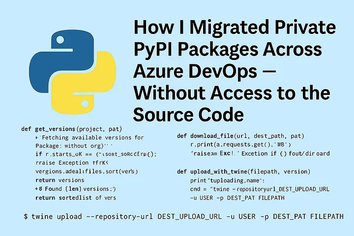

## Introduction
Migrating private PyPI packages between Azure DevOps organizations may sound like a trivial task—until you realize you don’t have access to the source organization or the upstream feed.

<!-- truncate -->

In this article, I walk through how I moved packages from a private PyPI feed in one Azure DevOps organization to another, without needing any backend or admin access to the source organization.

## The Problem

Our organization had multiple Azure DevOps orgs, each managing its own feeds for private Python packages. As part of an enterprise-wide initiative to centralize DevOps operations, we had to merge these orgs and move all internal packages into a unified feed.

Unfortunately, this wasn’t just a matter of updating setup.py and republishing. In many cases:

- The source repositories no longer existed.
- The build pipelines had been decommissioned.
- The only remaining evidence of the package was its artifact in the original feed.

## The Goal
Build a CLI tool that:

- Migrates PyPI packages across Azure DevOps orgs or projects
- Works even if the original source code is gone
- Handles .whl and .tar.gz packages
- Skips already uploaded or deleted versions
 -Is resilient, idempotent, and easy to use

## The Solution

I built a CLI in Python that:

- Lists available package versions from the source feed (using HTML scraping and Azure DevOps REST APIs)
- Downloads each package file using HTTP Basic Auth (via Personal Access Token)
- Uploads to the destination feed using twine, while handling common errors like duplicates or deleted versions
- It supports both organization-scoped and project-scoped feeds, and it can be run repeatedly without breaking anything.

## Source Code 

Save the source code as migrate_pypi_cli.py

```python
import argparse
import os
import re
import requests
import subprocess
from pathlib import Path
from bs4 import BeautifulSoup

USER = "user"
DOWNLOAD_DIR = Path("downloaded_packages")


def build_urls(org, feed, project, package):
    base_path = f"{org}/{project}" if project else org
    simple_url = f"https://pkgs.dev.azure.com/{base_path}/_packaging/{feed}/pypi/simple/"
    upload_url = f"https://pkgs.dev.azure.com/{base_path}/_packaging/{feed}/pypi/upload"
    api_url = f"https://feeds.dev.azure.com/{base_path}/_apis/packaging/feeds/{feed}/pypi/packages/{package}/versions?api-version=7.1-preview.1"
    return simple_url, upload_url, api_url


def get_versions(package, index_url, auth):
    print(f"🔍 Fetching versions for {package} from {index_url}...")
    r = requests.get(f"{index_url}{package}/", auth=auth)
    if r.status_code != 200:
        raise Exception(f"❌ Failed to fetch index: {r.status_code} - {r.text}")

    soup = BeautifulSoup(r.text, "html.parser")
    files = {}
    for tag in soup.find_all("a"):
        href = tag.get("href", "").split("#")[0]
        filename = href.split("/")[-1]
        match = re.search(rf"{package.replace('-', '_')}-([0-9a-zA-Z.\-_]+)\.(whl|tar\.gz)", filename)
        if match:
            version = match.group(1)
            files[version] = href
    print(f"✅ Found {len(files)} versions: {sorted(files.keys())}")
    return files


def download_file(url, dest_path, auth):
    r = requests.get(url, auth=auth)
    if r.status_code == 200:
        with open(dest_path, "wb") as f:
            f.write(r.content)
        print(f"✅ Downloaded: {dest_path.name}")
    else:
        raise Exception(f"❌ Failed to download {url} - {r.status_code}\n{r.text}")


def destination_version_exists(version, api_url, auth, uploaded_versions):
    if version in uploaded_versions:
        return True
    r = requests.get(api_url, auth=auth)
    if r.status_code == 200:
        existing = {v["version"] for v in r.json().get("value", [])}
        uploaded_versions.update(existing)
        return version in existing
    return False


def upload_with_twine(filepath, version, upload_url, auth_password, api_url, uploaded_versions):
    if destination_version_exists(version, api_url, auth_password, uploaded_versions):
        print(f"⚠️ Skipping {version}: already exists.")
        return

    print(f"⬆️ Uploading {filepath.name}...")
    cmd = [
        "twine", "upload",
        "--repository-url", upload_url,
        "-u", USER,
        "-p", auth_password,
        str(filepath)
    ]
    result = subprocess.run(cmd, capture_output=True, text=True)
    stderr_lower = result.stderr.lower()
    if result.returncode == 0 or "already contains file" in result.stdout.lower():
        print(f"✅ Uploaded or already exists: {filepath.name}")
        uploaded_versions.add(version)
    elif "has been deleted" in stderr_lower and "cannot be restored" in stderr_lower:
        print(f"⚠️ Skipped {filepath.name}: deleted and cannot be re-pushed.")
    else:
        print(f"❌ Failed to upload {filepath.name}\n{result.stdout}\n{result.stderr}")


def main():
    parser = argparse.ArgumentParser(description="Migrate PyPI packages between Azure DevOps feeds.")
    parser.add_argument("--source-org", required=True)
    parser.add_argument("--source-feed", required=True)
    parser.add_argument("--source-pat", required=True)
    parser.add_argument("--package", required=True)
    parser.add_argument("--dest-org", required=True)
    parser.add_argument("--dest-feed", required=True)
    parser.add_argument("--dest-pat", required=True)
    parser.add_argument("--source-project", default="")
    parser.add_argument("--dest-project", default="")
    args = parser.parse_args()

    source_index, _, _ = build_urls(args.source_org, args.source_feed, args.source_project, args.package)
    _, dest_upload, dest_api = build_urls(args.dest_org, args.dest_feed, args.dest_project, args.package)

    package_dir = DOWNLOAD_DIR / args.package
    package_dir.mkdir(parents=True, exist_ok=True)

    uploaded_versions = set()
    file_map = get_versions(args.package, source_index, auth=(USER, args.source_pat))

    for version, url in file_map.items():
        filename = url.split("/")[-1]
        dest_file = package_dir / filename
        if not dest_file.exists():
            try:
                download_file(url, dest_file, auth=(USER, args.source_pat))
            except Exception as e:
                print(f"⛔ Skipping {version}: {e}")
                continue

    for wheel in package_dir.glob("*"):
        match = re.search(rf"{args.package.replace('-', '_')}-([0-9a-zA-Z.\-_]+)\.(whl|tar\.gz)", wheel.name)
        if not match:
            print(f"⚠️ Skipping unrecognized file: {wheel.name}")
            continue
        version = match.group(1)
        try:
            upload_with_twine(wheel, version, dest_upload, args.dest_pat, dest_api, uploaded_versions)
        except Exception as e:
            print(f"⛔ Upload error for {wheel.name}: {e}")


if __name__ == "__main__":
    main()
```

## How it Works?

```python
# Project Scoped
python migrate_pypi_cli.py \
  --source-org "SourceOrg" \
  --source-feed ProjectScopedFeed \
  --source-pat $AZURE_PAT \
  --package python-utilities-tfc \
  --dest-org "DestinationOrg" \
  --dest-feed ProjectScopedFeed \
  --dest-pat $DEST_PAT \
  --source-project Automation \
  --dest-project Automation

# Org Scoped
python migrate_pypi_cli.py \
  --source-org "SourceOrg" \
  --source-feed "SourceOrg" \
  --source-pat $AZURE_PAT \
  --package python-utilities-tfc \
  --dest-org "DestinationOrg" \
  --dest-feed "DestinationOrg \
  --dest-pat $DEST_PAT \
```

The tool:

- Authenticates to both feeds using your PAT
- Downloads any .whl or .tar.gz that isn’t already present
- Uploads each to the destination feed using twine
- Skips anything that already exists or was deleted

## Expected Output

```
🔍 Fetching versions for python-utilities-tfc from https://pkgs.dev.azure.com/...
✅ Found 2 versions: ['0.5.1', '1.9.0']

⬇️ Downloading: python_utilities_tfc-0.5.1-py3-none-any.whl
✅ Downloaded: python_utilities_tfc-0.5.1-py3-none-any.whl

⬆️ Uploading: python_utilities_tfc-0.5.1-py3-none-any.whl
⚠️ Skipping upload: version 0.5.1 already exists in destination.

⬆️ Uploading: python_utilities_tfc-1.9.0-py3-none-any.whl
✅ Successfully uploaded: python_utilities_tfc-1.9.0-py3-none-any.whl
```

