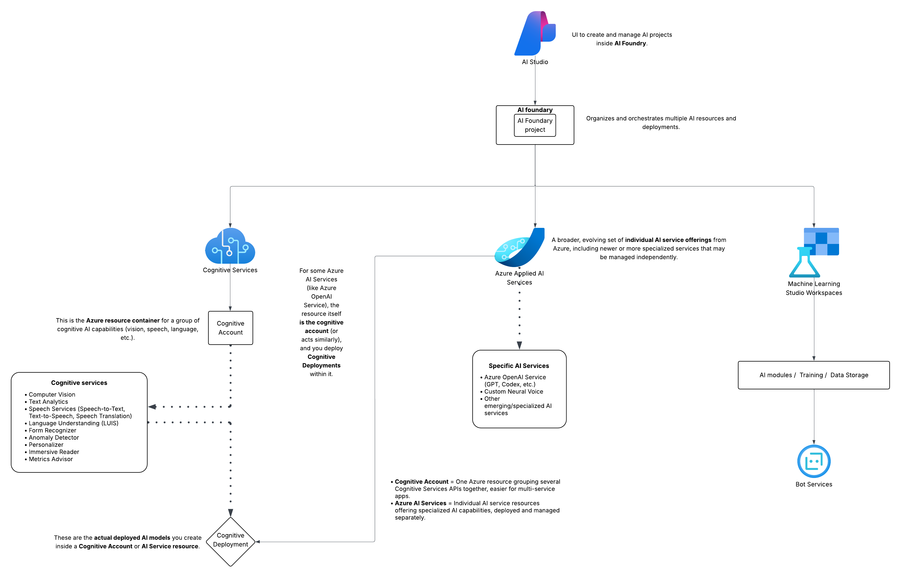

<!-- truncate -->

Azure AI is Microsoft’s suite of cloud-based artificial intelligence services that makes it easy for developers and organizations to build intelligent applications — without needing to be AI experts.

It offers a wide range of tools and APIs to help you add capabilities like vision recognition, speech processing, language understanding, and machine learning to your apps with just a few lines of code.

## What is Azure AI?

Azure AI is a collection of cloud services and tools from Microsoft that help you add smart, intelligent features to your applications without needing to build complex AI from scratch.

It includes things like:

- Understanding and analyzing images (e.g., recognizing objects or faces)
- Translating languages automatically
- Converting speech to text and vice versa
- Understanding and processing natural language (like chatbots)
- Building and running your own machine learning models easily

## Why do we need Azure AI?

- Save time and effort: Instead of creating AI models from zero (which takes lots of expertise and computing power), you use ready-made services.
- Scale easily: Azure handles all the infrastructure so your AI can handle millions of users without you managing servers.
- Stay updated: Microsoft maintains and improves the AI models, so you get better accuracy and features over time automatically.
- Focus on your business: You can quickly add AI capabilities to your apps and focus on your core product rather than the AI technology details.
- Cost-effective: Pay only for what you use, and avoid the huge upfront costs of building AI infrastructure.

## Azure AI Products and Services

| Service                 | Purpose                                  | Provisionable Resource?                                                            |
|-------------------------|------------------------------------------|------------------------------------------------------------------------------------|
| Cognitive Services      | Pre-built AI APIs                        | Yes (`azurerm_cognitive_account`)                                                  |
| Azure Machine Learning  | Custom ML lifecycle                      | Yes (`azurerm_machine_learning_workspace`)                                         |
| Azure OpenAI Service    | Advanced language models                 | Yes (`azurerm_ai_services`)                                                        |
| Azure Bot Service       | Intelligent chatbot framework            | Yes (`azurerm_bot_channel_registration`)                                           |
| Form Recognizer         | Document data extraction                 | Part of Cognitive Services (via `azurerm_cognitive_account`) or specific API usage |
| Anomaly Detector        | Anomaly detection                        | Part of Cognitive Services (`azurerm_cognitive_account`)                           |
| Personalizer            | Personalized recommendations             | Part of Cognitive Services (`azurerm_cognitive_account`)                           |
| Immersive Reader        | Reading assistance features              | Part of Cognitive Services (`azurerm_cognitive_account`)                           |
| Metrics Advisor         | Metrics monitoring                       | Part of Cognitive Services (`azurerm_cognitive_account`)                           |
| Azure AI Foundry Project| Logical workspace/project inside Foundry | Yes (`azurerm_ai_foundry_project`)                                                 |
| Azure AI Foundry        | AI lifecycle & project management        | Yes (`azurerm_ai_foundry`)                                                         |
| Azure AI Studio         | UI/portal for AI project & resource mgmt | Yes (`azurerm_ai_studio`)                                                          |

## Architecture Diagram

At a high level, an Azure AI module can be built using this architecture diagram.

