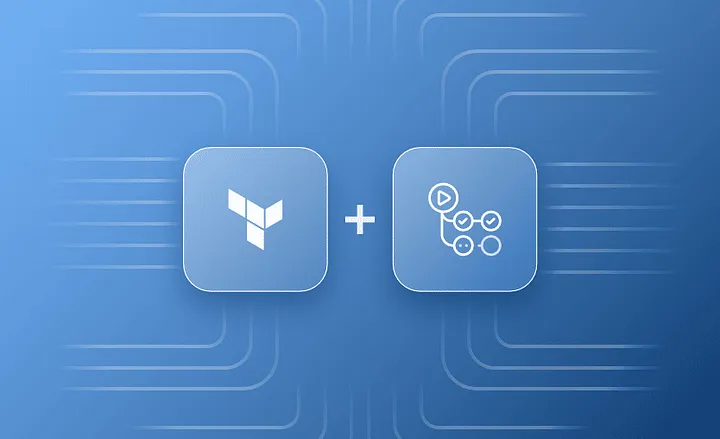

<!-- truncate -->

In modern cloud-native development, infrastructure automation plays a pivotal role in enabling teams to deliver faster and more reliably. Terraform, being one of the leading Infrastructure as Code (IaC) tools, is frequently integrated into CI/CD pipelines to provision and manage cloud resources.

This article discusses how to create a reusable Terraform deployment workflow that can be easily integrated into any DevOps pipeline, especially within platforms like Azure DevOps or GitHub Actions.

## Why Reusable Workflows?

Reusable workflows promote consistency, reduce duplication, and make it easier to manage infrastructure across different environments or projects. Instead of copying and pasting Terraform deployment logic in every pipeline, you can define it once and reuse it.

## Workflow Design

At a high level, a Terraform deployment workflow consists of the following stages:

1. **Initialization**  
   Run `terraform init` to initialize the working directory containing Terraform configuration files.

2. **Validation**  
   Use `terraform validate` to check whether the configuration is syntactically valid and internally consistent.

3. **Formatting**  
   `terraform fmt -check` ensures that the code is formatted according to best practices.

4. **Planning**  
   Execute `terraform plan` to see the changes Terraform will apply.

5. **Apply (optional)**  
   `terraform apply` to make actual changes to the infrastructure, gated by approvals or specific conditions.

## Modular Pipeline Example

You can create a reusable pipeline template that accepts variables like:

- Path to Terraform code
- Target environment
- Resource group or backend config

This allows the same pipeline logic to be applied across multiple modules or environments.

## Benefits

- **Scalability**: Easily apply the same logic across teams.
- **Security**: Enforce approval gates before applying.
- **Audibility**: Centralized logs and visibility of deployment.

## Conclusion

By building reusable Terraform workflows, organizations can accelerate their infrastructure delivery while reducing operational overhead. This approach also helps enforce governance and best practices consistently.

> For a more detailed walkthrough and pipeline YAML examples, check the full article on [Medium](https://medium.com/@umarkhan_87391/reusable-terraform-deployment-workflow-bdf35b8529f4).
